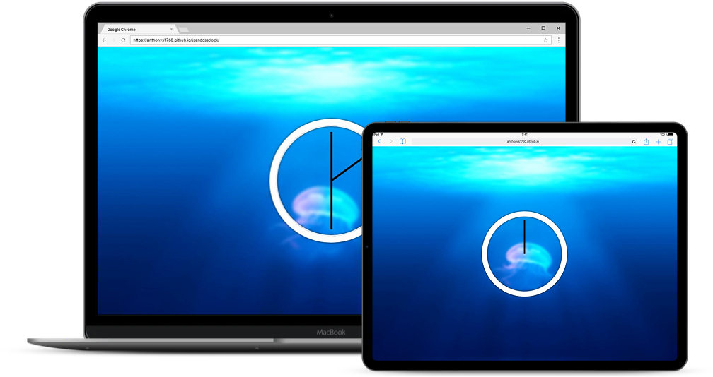

# Javascript & CSS Clock

Hello 👋 Thanks for checking out this project. I created this JavaScript and CSS clock to show the current time ⏰

 ## [View Live Site](https://anthonys1760.github.io/jsandcssclock/) 

